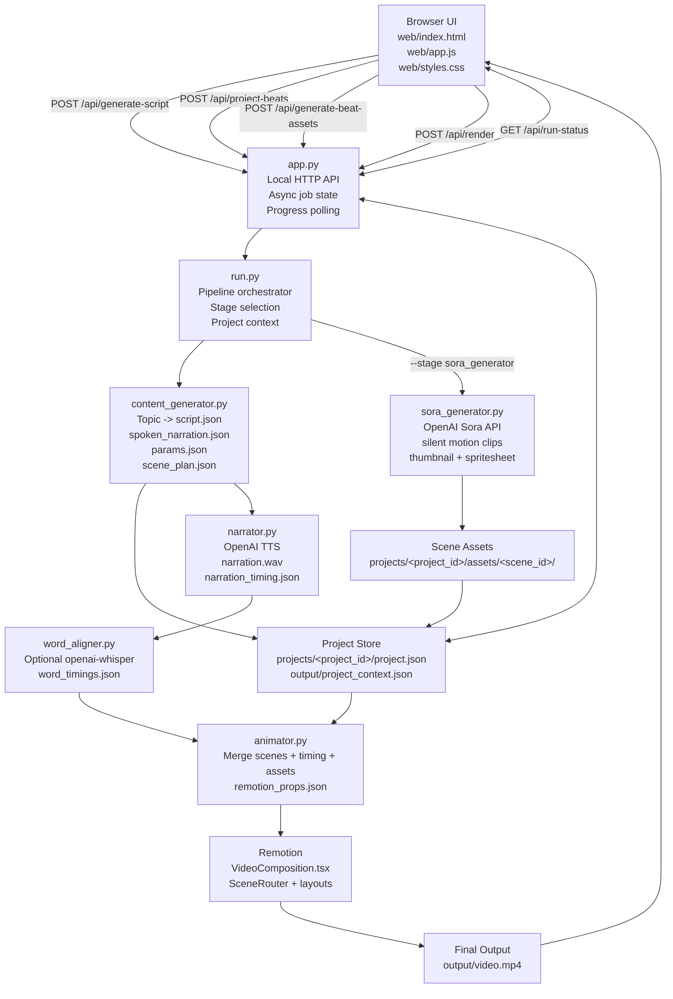

# ReelGPT Studio

ReelGPT Studio turns a topic brief into a polished vertical AI reel.

The app generates a structured script, lets the user review narration and scene configuration, optionally generates Sora motion plates for selected scenes, then renders the final MP4 through Remotion.

## What It Does

- Create a reel draft from a title and source notes.
- Generate structured scene data for infographic-style vertical video.
- Review and edit narration before voice generation.
- Choose built-in visual themes or a custom render theme.
- Switch individual scenes between infographic, animation, and hybrid modes.
- Generate silent Sora video assets for selected motion scenes.
- Preview generated Sora scene assets in the UI.
- Estimate text, TTS, and Sora generation cost before running.
- Render the final vertical MP4 and download it from the browser.

## Product Flow

1. Enter a title and source notes.
2. Click `Create Reel Draft`.
3. Review the generated narration.
4. Open `Scene Plan`.
5. Keep scenes as infographic, or switch selected scenes to `animation` or `hybrid`.
6. Add or edit the Sora prompt for motion scenes.
7. Click `Generate Motion Assets` or generate one scene.
8. Render the final video.
9. Download `output/video.mp4`.

## Pipeline Overview

```text
Browser UI
  -> app.py HTTP API
  -> run.py orchestrator
  -> content_generator
  -> narrator
  -> word_aligner
  -> animator
  -> Remotion render
  -> output/video.mp4

Optional motion branch:
Browser UI
  -> app.py HTTP API
  -> run.py --stage sora_generator
  -> OpenAI Sora video API
  -> projects/<project_id>/assets/<scene_id>/
  -> animator merges ready motion assets into Remotion props
```

## Architecture

```text
+------------------+        +------------------+        +------------------+
| Browser UI       |        | app.py           |        | run.py           |
| web/index.html   +------->| local HTTP API   +------->| stage runner     |
| web/app.js       |        | async job state  |        | project context  |
+--------+---------+        +--------+---------+        +--------+---------+
         |                           |                           |
         |                           v                           v
         |                  +------------------+        +------------------+
         |                  | Project Store    |        | Content Stage    |
         |                  | projects/*.json  |        | script + scenes  |
         |                  +--------+---------+        +--------+---------+
         |                           |                           |
         |                           |                           v
         |                           |                  +------------------+
         |                           |                  | Narrator Stage   |
         |                           |                  | OpenAI TTS       |
         |                           |                  +--------+---------+
         |                           |                           |
         |                           |                           v
         |                           |                  +------------------+
         |                           |                  | Word Aligner     |
         |                           |                  | optional Whisper |
         |                           |                  +--------+---------+
         |                           |                           |
         |                           |                           v
         |                  +--------+---------+        +------------------+
         |                  | Sora Generator   |        | Animator Stage   |
         |                  | motion assets    +------->| Remotion props   |
         |                  +--------+---------+        +--------+---------+
         |                           |                           |
         |                           |                           v
         |                           |                  +------------------+
         |                           +----------------->| Remotion Render  |
         |                                              | output/video.mp4 |
         |                                              +------------------+
         |
         v
+------------------+
| Preview/Download |
+------------------+
```

## SVG Diagram Source

Generated architecture SVG:

```text
/Users/uditrawat/Downloads/reelgpt_studio_architecture.svg
```

Use this Mermaid block to generate an architecture SVG.



The same Mermaid source is also stored at `docs/architecture.mmd`.

Generate SVG with Mermaid CLI:

```bash
npx @mermaid-js/mermaid-cli -i docs/architecture.mmd -o docs/architecture.svg
```

Alternative Graphviz DOT source:

```dot
digraph ReelGPTStudio {
  rankdir=LR;
  graph [fontname="Inter", bgcolor="#0b0d10"];
  node [shape=box, style="rounded,filled", fontname="Inter", color="#334155", fillcolor="#111827", fontcolor="#f8fafc"];
  edge [fontname="Inter", color="#60a5fa", fontcolor="#cbd5e1"];

  UI [label="Browser UI\nweb/index.html\nweb/app.js"];
  API [label="app.py\nHTTP API\nasync job state"];
  RUN [label="run.py\norchestrator"];
  STORE [label="Project Store\nprojects/<project_id>/project.json"];
  CONTENT [label="content_generator.py\nscript + scene data"];
  NARRATOR [label="narrator.py\nOpenAI TTS"];
  ALIGN [label="word_aligner.py\noptional Whisper cues"];
  SORA [label="sora_generator.py\nOpenAI Sora motion"];
  ASSETS [label="Scene Assets\nvideo + thumbnail + spritesheet"];
  ANIMATOR [label="animator.py\nRemotion props"];
  REMOTION [label="Remotion\nVideoComposition.tsx"];
  OUT [label="output/video.mp4"];

  UI -> API [label="API calls + polling"];
  API -> RUN [label="start job"];
  API -> STORE [label="load/save projects"];
  RUN -> CONTENT;
  CONTENT -> STORE;
  CONTENT -> NARRATOR;
  NARRATOR -> ALIGN;
  ALIGN -> ANIMATOR;
  RUN -> SORA [label="motion stage"];
  SORA -> ASSETS;
  ASSETS -> STORE;
  STORE -> ANIMATOR;
  ANIMATOR -> REMOTION;
  REMOTION -> OUT;
  OUT -> UI [label="preview/download"];
}
```



The same DOT source is also stored at `docs/architecture.dot`.

Generate SVG with Graphviz:

```bash
dot -Tsvg docs/architecture.dot -o docs/architecture.svg
```

## Core Components

| Component | Path | Role |
|---|---|---|
| Browser UI | `web/` | Product interface, scene controls, live status, cost estimate, video preview |
| API server | `app.py` | Serves UI, handles API routes, starts background jobs, exposes progress |
| Orchestrator | `run.py` | Runs pipeline stages and writes project context |
| Project model | `pipeline/project_schema.py` | Defines project, scene, mode, and asset records |
| Project storage | `pipeline/project_store.py` | Loads, saves, duplicates, and syncs project snapshots |
| Content generation | `pipeline/content_generator.py` | Produces structured script, scene plan, Remotion scene payloads, and cue definitions |
| Narration | `pipeline/narrator.py` | Generates OpenAI TTS audio and segment timing |
| Word alignment | `pipeline/word_aligner.py` | Optionally creates word-level timing cues with `openai-whisper` |
| Sora motion | `pipeline/sora_generator.py` | Creates silent Sora motion clips for animation/hybrid scenes |
| Animation bridge | `pipeline/animator.py` | Merges scene data, timing, theme, Sora assets, and render overrides into Remotion props |
| Remotion app | `remotion/src/` | Renders the final vertical video |

## Data Flow

| Step | Input | Output |
|---|---|---|
| Topic input | title + source notes | `output/topic.json` |
| Content generation | topic + theme | `script.json`, `spoken_narration.json`, `params.json`, `scene_plan.json`, `cue_definitions.json` |
| Project sync | pipeline outputs | `projects/<project_id>/project.json` |
| Narration | spoken narration | `narration.wav`, `narration_timing.json` |
| Word alignment | narration audio | `word_timings.json` or segment-only fallback |
| Sora generation | scene prompt + mode | `projects/<project_id>/assets/<scene_id>/video.mp4` |
| Props assembly | params + timing + project assets | `output/remotion_props.json` |
| Final render | Remotion props + public assets | `output/video.mp4` |

## Project Model

Each project is stored under:

```text
projects/<project_id>/project.json
```

Project records include:

- topic title and source notes
- selected theme
- raw script and spoken narration
- scene records
- scene mode: `infographic`, `animation`, or `hybrid`
- Sora prompt and generated asset references
- render text overrides
- timing metadata
- output file references

## Scene Modes

| Mode | Behavior |
|---|---|
| `infographic` | Render only structured Remotion graphics |
| `animation` | Use Sora video as the main visual scene |
| `hybrid` | Use Sora video as a motion plate with infographic overlay |

Sora prompts are forced toward silent video. The final audio comes from OpenAI TTS narration, not from Sora.

## Cost Estimation

The UI shows an estimated spend panel for:

- text generation
- narration TTS
- Sora motion generation

Sora estimates use selected motion scenes and the configured video model/size.

Current default config:

```text
OPENAI_TEXT_MODEL=gpt-4.1-mini
OPENAI_TTS_MODEL=gpt-4o-mini-tts
OPENAI_VIDEO_MODEL=sora-2
OPENAI_VIDEO_SIZE=720x1280
```

The estimate is informational. Real billing should be checked against OpenAI API usage.

## Setup

Install Python dependencies:

```bash
python3 -m pip install -r requirements.txt
```

Install Remotion dependencies:

```bash
cd remotion
npm install
cd ..
```

Optional word-level alignment:

```bash
python3 -m pip install openai-whisper
```

Environment:

```bash
export OPENAI_API_KEY="sk-..."
```

Optional video config:

```bash
export OPENAI_VIDEO_MODEL="sora-2"
export OPENAI_VIDEO_SIZE="720x1280"
export OPENAI_VIDEO_POLL_SECONDS="10"
export OPENAI_VIDEO_MAX_WAIT_SECONDS="1200"
```

## Run The UI

```bash
python3 app.py
```

Open:

```text
http://127.0.0.1:8000
```

## CLI Usage

Full infographic render:

```bash
python3 run.py \
  --title "Your topic here" \
  --summary "Optional source notes or factual summary" \
  --theme deep_winter
```

Generate draft content only:

```bash
python3 run.py \
  --stage content_generator \
  --title "Your topic here" \
  --summary "Optional source notes or factual summary" \
  --theme deep_winter
```

Generate Sora motion assets for an existing project:

```bash
python3 run.py \
  --stage sora_generator \
  --project-id "<project_id>"
```

Generate Sora motion for one scene:

```bash
python3 run.py \
  --stage sora_generator \
  --project-id "<project_id>" \
  --beat-id "beat_2"
```

Render with a narration override:

```bash
python3 run.py \
  --title "Your topic here" \
  --summary "Optional source notes" \
  --narration '{"hook":"...","concept_1":"...","concept_2":"...","takeaway_cta":"..."}'
```

## Outputs

Generated under `output/`:

- `topic.json`
- `theme.json`
- `custom_theme.json`
- `script.json`
- `spoken_narration.json`
- `narration.wav`
- `narration_timing.json`
- `word_timings.json`
- `params.json`
- `scene_plan.json`
- `remotion_props.json`
- `pipeline.log`
- `video.mp4`

Generated under `projects/`:

- `projects/current_project.json`
- `projects/<project_id>/project.json`
- `projects/<project_id>/assets/<scene_id>/video.mp4`
- `projects/<project_id>/assets/<scene_id>/thumbnail.webp`
- `projects/<project_id>/assets/<scene_id>/spritesheet.jpg`

## Notes

- The UI intentionally hides raw logs and shows run-status heuristics instead.
- The browser polls `/api/run-status` for live stage progress.
- If `openai-whisper` is missing, the pipeline still renders with segment-level timing.
- Render text props can be edited per scene from the UI and are applied after content generation.
- Sora motion clips are requested in supported durations and looped in Remotion to fill the scene duration.
