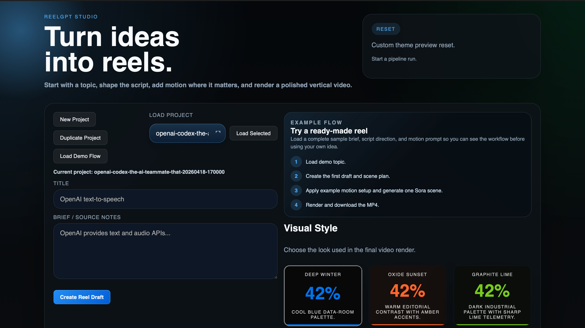
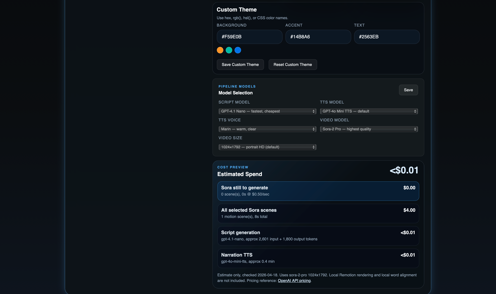
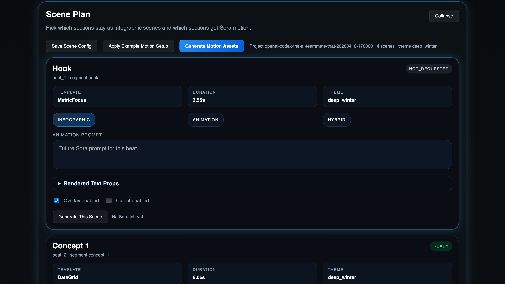
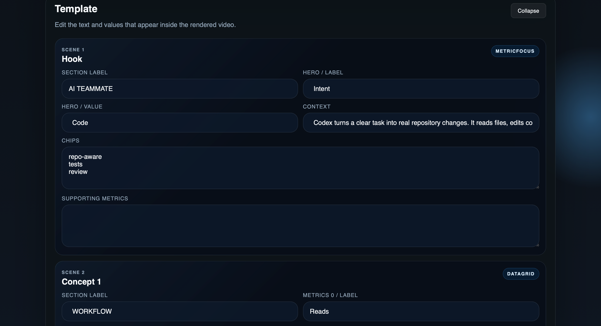
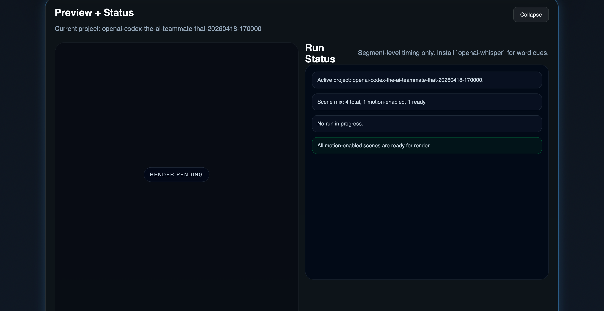
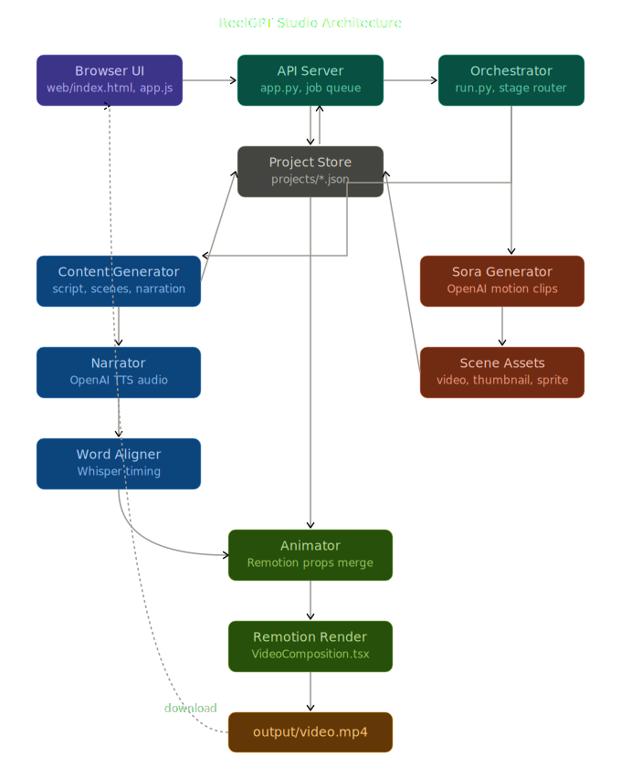

# ReelGPT Studio

Turn a topic brief into a polished vertical AI reel — script, voice, motion, and MP4 — without touching a video editor.

## Demo

**Full Pipeline Walkthrough**

https://github.com/udit-rawat/codex-community-hackathon-del-reel-gpt/releases/download/demo-assets/demo-pipeline.mp4

**Sample Output Reel**

https://github.com/udit-rawat/codex-community-hackathon-del-reel-gpt/releases/download/demo-assets/demo-output.mp4

## Screenshots

Start with a topic, load a saved project, or pick a visual theme before generating your reel.


Dial in your color palette, choose models for each pipeline stage, and preview your estimated spend upfront.


Decide how each scene moves — keep it as an infographic, trigger a Sora clip, or blend both.


Fill in your section labels, hero values, and context chips to shape exactly what appears on screen.


Watch your run status live and confirm every motion asset is ready before you hit download.


## What It Does

- Draft a reel from a title and source notes
- Review and edit narration per scene before voice generation
- Switch scenes between `infographic`, `animation`, and `hybrid` modes
- Generate Sora motion clips for selected scenes
- Preview cost estimate (text + TTS + Sora) before committing
- Render and download the final vertical MP4 from the browser

## Flow

1. Enter title + source notes → **Create Reel Draft**
2. Review narration → open **Scene Plan**
3. Set scene modes, add Sora prompts
4. **Generate Motion Assets** (all or per scene)
5. **Render** → download `output/video.mp4`

## Architecture



```
Browser UI → app.py (HTTP API) → run.py (orchestrator)
  ├── content_generator  →  script, scene plan, narration
  ├── narrator           →  OpenAI TTS audio
  ├── word_aligner       →  Whisper timing cues
  ├── sora_generator     →  OpenAI Sora motion clips  [optional]
  ├── animator           →  Remotion props merge
  └── Remotion render    →  output/video.mp4
```

## Stack

| Layer | Tech |
|---|---|
| Script + scenes | `gpt-4.1-nano` |
| Voice | `gpt-4o-mini-tts` with `marin` voice |
| Motion clips | `sora-2-pro` @ 1024×1792 |
| Render | Remotion (`VideoComposition.tsx`) |
| API server | `app.py` (Python HTTP) |

## Setup

```bash
pip install -r requirements.txt
cd remotion && npm install && cd ..
export OPENAI_API_KEY="sk-..."
```

Optional word-level timing:
```bash
pip install openai-whisper
```

Optional Sora config:
```bash
export OPENAI_VIDEO_MODEL="sora-2-pro"
export OPENAI_VIDEO_SIZE="1024x1792"
```

## Run

```bash
python3 app.py        # start UI at http://127.0.0.1:8000
```

CLI usage:
```bash
# Full render
python3 run.py --title "Topic" --summary "Notes" --theme deep_winter

# Sora motion only (existing project)
python3 run.py --stage sora_generator --project-id "<id>"

# Single scene
python3 run.py --stage sora_generator --project-id "<id>" --beat-id "beat_2"
```

## Scene Modes

| Mode | Behavior |
|---|---|
| `infographic` | Structured Remotion graphics only |
| `animation` | Sora video as main visual |
| `hybrid` | Sora motion plate + infographic overlay |

## Key Outputs

```
output/video.mp4
output/remotion_props.json
projects/<id>/project.json
projects/<id>/assets/<scene_id>/video.mp4
```
